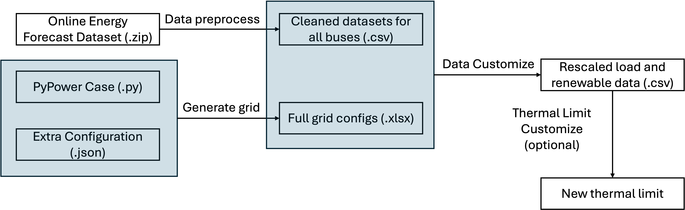

# Power System Operation in Python

**We are still at the early stage of the implementation. There will be more functionalities and flexible I/Os coming in the future. Please watch us progress to have the latest update.**

This repo is developed and maintained by [Wangkun Xu](https://profiles.imperial.ac.uk/wangkun.xu18) at Control and Power research group, Imperial College London.

## Introduction



The main purpose of this repository is to 
1. Provide an efficient I/O for generating the power system testbeds for optimization problem.
2. Host a set of basic power system operation formulations for the future research and teaching purposes. This repo contains some basic power system operations written in Python and formulated by `cvxpy`, such as:
    - Network Constrained Unit Commitment (with/out integer variables, and various tim e steps) (finished) 
    - Economic Dispatch (finished)
    - Stochastic Unit Commitment (ongoing)
3. The package also comes with an efficient modifications of the load, solar, and wind data that are suitable for the proposed power system case study. Therefore, it can be used to train machine and deep learning models with large training dataset.

## Package Dependencies

[cvxpy](https://www.cvxpy.org/): is an open source Python-embedded modeling language for convex optimization problems. It lets you express your problem in a natural and matrix way that follows the math, rather than in the restrictive standard form required by different solvers. 

Note: you may also need to have Gurobi, Mosek or other optimization software to efficiently solve the optimization problems, especially if integers are included. Please refer [here](https://www.cvxpy.org/tutorial/advanced/index.html) for details.

[PyPower](https://github.com/rwl/PYPOWER): is a power flow and Optimal Power Flow (OPF) solver. It also hosts a set of commonly used power system testbeds. It is a part of MATPOWER to the Python programming language.

Other packages inlcudes 
```
openpyxl, XlsxWriter
```
for efficient I/O of the `.xlsx` files.

## References

The implementation of this repo follows the online cource [here](https://u.osu.edu/conejo.1/courses/power-system-operations/) and the textbook *Power System Operations* [here](https://link.springer.com/book/10.1007/978-3-319-69407-8), both by Prof. Antonio Conejo. We also write a series of blog posts to explain the formulation used in the code, including:
- [Power system AC and DC modeling](https://xuwkk.github.io/blog/posts/learning/power_system/power_system_operation.html)
- [Unit Commitment](https://xuwkk.github.io/blog/posts/learning/power_system/ncuc.html)
- [Economic Dispatch](https://xuwkk.github.io/blog/posts/learning/power_system/ed.html)

## Development Progress

| Case Name | Data Generation | Grid Formulation | Continuous UC and ED | Binary UC and ED | Stochastic UC and ED |
|-----------|-----------------|------------------| ----------------------|------------------| ---------------------|
| case14    |:heavy_check_mark:|:heavy_check_mark:|:heavy_check_mark:| :question:| :x: |
| case39    |:heavy_check_mark:|:heavy_check_mark:|:heavy_check_mark:| :question:| :x: |
| case118    |:heavy_check_mark:|:heavy_check_mark:|:heavy_check_mark:| :question:| :x: |

## Usage

Note: the data generation is not necessary for power system operation. You can consider use this part to generate dataset for training machine learning models, such as load, solar, and wind forecasting.

### Step one: Clean Raw Data

We use open source dataset from [A Synthetic Texas Backbone Power System with Climate-Dependent Spatio-Temporal Correlated Profiles](https://arxiv.org/abs/2302.13231). You can download/read the descriptions of the dataset from [the official webpage](https://rpglab.github.io/resources/TX-123BT/). 

*Please cite/recogenize the original authors if you use the dataset.*

After download the the `.zip` file into the `data/` and change the name into `raw_data.zip`, unzip the file by 
```bash
unzip data/raw_data.zip -d data/
```

This will give a new folder `data/Data_public/`. 

Then we need to group the feature-label pairs for each data (bus). There are 123 buses in the Texas backbone power system. To group the data, run
```python
from data import group_data
group_data()
```

This will result in folder `data/data_grouped/` which contains `.csv` files for all 123 buses dataset.

> Note: This may take several minutes but you only need to run this script once. 

### Step two: Generate Power Grid Testbed

The optimization formulation relies on reading system configuration from a `.xlsx` file. There are several ways to construct the configuration file, either from scratch or build it from existing configurations via the `PyPower` package. An example file can be found [here](configs/case14.xlsx).

We recommend to construct the `.xlsx` file from the basic `PyPower` file to avoid errors. The `PyPower` contains useful grid topology and parameters that can be directly read by the package. However, you must include several necessary extra configs (that are not covered by the `PyPower`) to support the full functionality of power system operation. For example, you need to specifiy the up and down cost and limit of the generators to formulate the UC. An example can be found [here](configs/case14_default.json). The detailed description on how to construct the extra config file can be found [here](readme_configs.md).

For instance, to generate the case14, run
```python
from utils.loading import from_pypower
from_pypower('case14', 'configs/case14_default.json')
```

The function `from_pypower` will generate the `case14.xlsx` file in the `configs/` folder. It will also rescale the default load, solar, and wind data to the defined power_ratio in the config file.


### Step Three: Assign and Rescale the Data to Load

The next step is to assign the grouped data to the buses defined in the configuration file. First, the grouped data will be first assigned to the solar or wind buses. Then, the remaining bus will be assigned with the remaining grouped data. The solar, wind, and load will be rescaled into their default values.

For example, to assign the data to the case14, run

```python
from utils.modufy_data import assign_data
assign_data(
        xlsx_dir = f'configs/case14.xlsx',
        save_dir = f"data/case14/",
        seed = 0,
        force_new = True
        )
```

When `force_new` is set to `True`, the function will overwrite the existing files.

A new folder will be constructed with the modified grouped data in the sequence of the load.

### Step Four (optional): Rescale the thermal limit of the transmission lines

The thermal limit `pf_max` can be automatically altered based on the previously defined grid configuration, load level, generator level, and renewable levels so that the operation cannot be trivially solved. 

To achieve this for bus14 system, run 

```python
from utils.modufy_data import modify_pfmax
modify_pfmax(grid_op, with_int, T, 
                f"data/case14/", 
                min_pfmax = 0.1, 
                xlsx_dir = f"configs/case14.xlsx")
```

This will overwrite the `pf_max` column in the generated `.xlsx` file.

### One Step Generation

The `main.py` function is an end-to-end approach to generate all the configurations and data mentioend above. You can run the script by
```bash
python main.py -n case14 -c configs/case14_default.json -f
```
for the case14 example. `-n` is short for `--pypower_case_name`, `-c` is short for `--extra_config_path`, and `-f` is short for `--force_new` to generate new data. The `-f` flag will overwrite the existing files.

## Other Functions

### Reformulate the problem as standardard form QP/MIQP

The functions in `utils/standard_form.py` are developed to reformulate the UC/ED in `cvxpy` form into the correspinding standard form. This conversion is general in addition to the UC/ED. Therefore it can be used outside power system operation. In this sense, you can "standardize" your problem by leveraging the descriptive power of `cvxpy`, which can be useful for developing your own optimization algorithm or for physics-informed machine learning.

For a genenal QP/LP without integer variable, it transforms into:
$$
\begin{array}{rl}
\min & (1/2) x^TPx + q^Tx \\
\text{s.t.} & Ax = \sum_i B_i z_i + b \\
& Gx \leq \sum_i H_i z_i + h \\
\end{array}
$$
where $x$ is the decision variable, $z_i$ s are instance-dependent parameters. In power system operation, this can be the energy forecast for UC problem or the generator set-points for ED problem. $B_i$ and $H_i$ are the corresponding matrices for the $i$-th instance.

For a MIQP/MILP, it transforms into:
$$
\begin{array}{rl}
\min & (1/2) x^TPx + q^Tx \\
\text{s.t.} & Ax = \sum_i B_i z_i + b \\
& Gx \leq \sum_i H_i z_i + h \\
& x[\text{bool\_idx}] \in \{0, 1\} 
\end{array}
$$
where `bool_idx` is the index of the binary (or integer) variables.

## Test Files

The package comes with several ready-to-use test files in `test/`. You can learn most of the operations by reading the test files.

`test/data.py`: test if the data generation is correct. E.g., if the assigned load and renewable data have correct maximum values.
`test/grid_formulation.py`: test if the grid matrices are the same to the `PyPower` package.


## Comments and Extra Notes

Part of the dataset and power system optimization toolbox has been used in our previous paper:
1. Xu, Wangkun, Jianhong Wang, and Fei Teng. "E2E-AT: A Unified Framework for Tackling Uncertainty in Task-Aware End-to-End Learning." Proceedings of the AAAI Conference on Artificial Intelligence. Vol. 38. No. 14. 2024.
2. Xu, Wangkun, and Fei Teng. "Task-aware machine unlearning and its application in load forecasting." IEEE Transactions on Power Systems (2024).